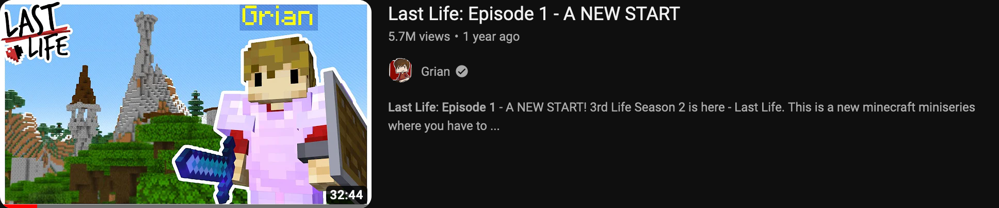
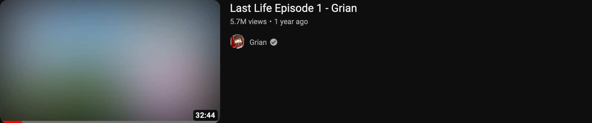

# Don't Spoil the Life Series

Don't Spoil the Life Series is a browser extension which helps avoid spoilers in thumbnails and titles from the Life Series created by [Grian](https://www.youtube.com/@Grian) (3rd Life, Last Life, Double Life, Limited Life).

Before:

After:

  
 Reasons to install (contains spoilers for the Life Series)

  
  Often the members of the Life Series will include major spoilers for the episodes in the title and thumbnail (such as "[Last Life episode 7: The Last Life Of Scar](https://www.youtube.com/watch?v=29vAW4df3Ic)", "[I'M THE FIRST PLAYER ELIMINATED!! | Last Life | #7](https://www.youtube.com/watch?v=Hv8fOuLU44U)", and [No More Bad Boys :( | Limited Life Ep.7](https://www.youtube.com/watch?v=y4zs5_HRXtQ&t=3s&pp=ygUNc21hbGxpc2hiZWFucw%3D%3D)). This can ruin the viewing experience because you already know what happens, so this extension helps to keep the surprise in the episodes.
  

## Features

- Supports all episodes from all four seaons from all members
- Blurs thumbnails
- Removes all details from titles except for the season name and episode number
- Hides comments section and video description for all episodes
- Works on the YouTube homepage, explore page, subscriptions page, channel pages (does not support the featured video yet) and watch pages
- Add the `lifespoilers=true` parameter to the URL to show spoilers (e.g. `https://www.youtube.com/?lifespoilers=true` or `https://www.youtube.com/watch?v=wOnGdYjjJGo&lifespoilers=true`)

### Planned features

- Support videos from other creators
- Don't censor videos past a certain date

- Censor the featured video on channel pages
- Censor anywhere else I forgot to implement
- Remove the thumbnail entirely, don't just blur
- Button to reveal comments and description
- Userscript version
- Mobile compatibility

## Installation

Currently the extension hasn't been submitted to either the Chrome Web Store or addons.mozilla.org, so you need to manually install it by downloading the version for your browser from the [Releases page](https://github.com/shock59/life-series-spoilers/releases/) and dragging and dropping it into the browser (on Chromium based browsers like Chrome and Edge you will need to be on the chrome://extensions page).

On Firefox, you must be using Developer Edition or Nightly and set `xpinstall.signatures.required` to `false` in about:config as the extension is unsigned. You will get a warning that it might be malicious, if you want to be completely sure that it is safe you can have a look at the code in this repository.

Make sure to check back on this page to see if there's a new update or if it has been accepted onto an extension store so that you can get automatic updates!

## Credits

- [All Life Series members](https://the-life-series.fandom.com/wiki/Members)
- [The Life Series Wiki](https://the-life-series.fandom.com/) for inspiration for the icon
